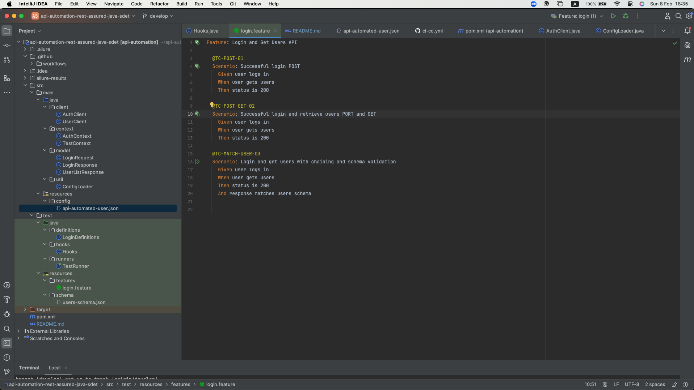
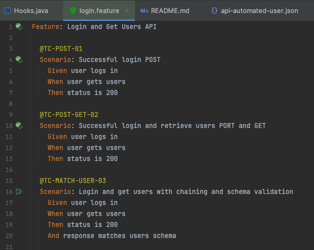

# API Automation Testing Project

API automation testing project built with Java, Rest Assured, Cucumber (BDD), JUnit, and Allure Report.

This project demonstrates login, API chaining (POST + GET), status validation, and JSON schema validation with readable Gherkin scenarios and reporting via Allure.

---

## Tech Stack

- Java 11+
- Maven
- Rest Assured
- Cucumber
- JUnit
- Allure Report

---

## Project Structure

api-automation-rest-assured-java-sdet

## Test Scenarios

Location:
src/test/resources/features/login.feature

---

## Run Tests

Run tests and remove old results:

mvn clean test

---

## Allure Report

Generate report (latest run only):

allure generate target/allure-results --clean -o target/allure-report

Open report:

allure open target/allure-report

---

## Common Issues

Allure report shows 0 test cases or UNKNOWN
- Tests did not run successfully
- Allure plugin not configured correctly
- Cucumber runner missing Allure plugin

403 Forbidden error
- Authorization token missing or expired
- Authorization header not passed to GET request
- Login request failed but test continued

Make sure Authorization header is set correctly when calling protected APIs.

---

## Test Runner Configuration

Cucumber runner uses Allure plugin:

- pretty
- io.qameta.allure.cucumberjunit.AllureCucumberJUnit

---

## Reports Location

- Test execution results: target/surefire-reports
- Allure raw results: target/allure-results
- Allure HTML report: target/allure-report

---

